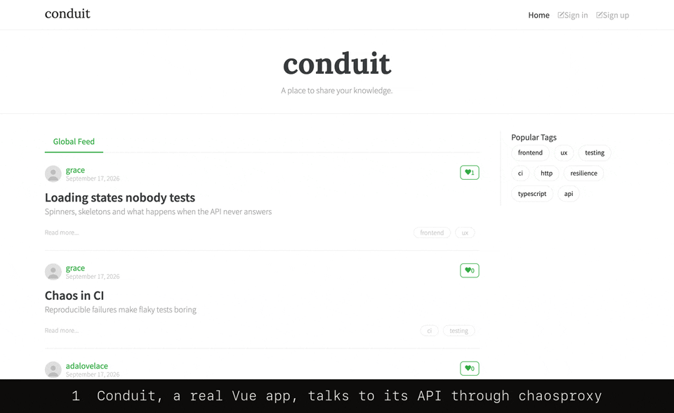

# Chaos Proxy

A HTTP-aware chaos proxy for frontend developers — configure latency, errors, truncation and payload mutations per route, in code, reproducibly, in CI.



```sh
npx @raxuis/chaosproxy --target http://localhost:9000 --profile flaky-api
# point the frontend's API base URL at http://localhost:7070
# watch every request on the dashboard at http://localhost:7071
```

`--target` is the real API, not the frontend. Chaos Proxy forwards every request
to it and injects failures on the way, so the frontend meets slow responses,
`503`s, dropped connections, and broken JSON without mocking anything.

- [Why Chaos Proxy](#why-chaos-proxy)
- [Install](#install)
- [Usage](#usage)
- [Fault catalog](#fault-catalog)
- [Configuration reference](#configuration-reference)
- [Profiles](#profiles)
- [Reproducibility](#reproducibility)
- [Scenarios](#scenarios)
- [Header overrides](#header-overrides)
- [Dashboard and control API](#dashboard-and-control-api)
- [CI integration](#ci-integration)
- [Security defaults](#security-defaults)

## Why Chaos Proxy

Frontends are usually tested against an API that always answers quickly and
correctly. Chaos Proxy makes the unhappy paths routine: a loading state that
never ends, a retry that must back off, a checkout that fails twice, a profile
whose `email` is suddenly `null`.

- **HTTP-aware**: rules match a method and a path glob, and faults speak HTTP:
  status codes with `Retry-After`, truncated bodies, mutated JSON fields.
- **In code**: one YAML file, validated with line numbers and reloaded on save.
- **Reproducible**: seeded decisions and scripted scenarios replay the same
  failures on every run.
- **Built for CI**: a single binary with a JSON run report, an exit code, and a
  Playwright fixture.

How it compares with tools frontend developers already use:

| | Chaos Proxy | [chaos-proxy](https://github.com/gkoos/chaos-proxy) (npm) | Toxiproxy | MSW | mitmproxy | Browser DevTools |
|---|---|---|---|---|---|---|
| Works at | HTTP reverse proxy, single Go binary | HTTP proxy on Koa, Node.js CLI and library | TCP proxy | request interception in the browser or Node.js | HTTP(S) intercepting proxy | the browser tab |
| Traffic | the real API | the real API | the real service | mocked handlers, optional passthrough | the real server | the real server |
| Targets | method and path globs | method and Koa Router paths, plus global middleware | a whole proxied port | handlers you write | Python addons you write | URL patterns, whole tab for throttling |
| Faults | latency, status, hang, reset, headers, truncation, bandwidth, JSON mutation | latency, failures, every-nth failures, dropped connections, rate limiting, throttling, custom middleware | latency, bandwidth, timeouts, resets, slicing, data limits | anything you code | anything you code | throttling, blocking, local overrides |
| Repeatable runs | seeds and step-by-step scenarios | every-nth failures | probabilistic toxicity | deterministic code | deterministic code | manual |
| Covers server-side fetches | yes | yes | yes | Node.js only, in process | yes, when configured as proxy | no |

Choose chaos-proxy for rate limiting or custom Node.js middleware, Toxiproxy for
databases and other non-HTTP services, MSW when there is no backend yet, and
mitmproxy to inspect or script arbitrary traffic. Choose Chaos Proxy to replay
the same HTTP failures, truncated bodies, and broken JSON payloads per route,
run after run, without writing interception code.

## Install

Chaos Proxy is a single binary for Linux, macOS, and Windows on amd64 and arm64.
Pick the channel that fits your project.

### npm

Requires Node.js 20 or newer. Run it without installing:

```sh
npx @raxuis/chaosproxy --target http://localhost:9000
```

Or add it to a frontend project so scripts and CI use a pinned version:

```sh
npm install --save-dev @raxuis/chaosproxy
npx chaosproxy --version
```

On first run the package downloads the binary for the current platform from the
matching GitHub release, verifies its SHA-256 checksum, and caches it. Set
`CHAOSPROXY_CACHE_DIR` to change the cache location.

### Homebrew

macOS and Linux:

```sh
brew install --cask raxuis/tap/chaosproxy
```

Upgrade with `brew upgrade --cask chaosproxy`.

### Go

Requires Go 1.25 or newer:

```sh
go install github.com/Raxuis/chaosproxy/cmd/chaosproxy@latest
```

### Binaries

Download an archive for your platform from the
[latest release](https://github.com/Raxuis/ChaosProxy/releases/latest), check it
against `checksums.txt`, and put `chaosproxy` on your `PATH`:

```sh
shasum -a 256 --check --ignore-missing checksums.txt
```

## Usage

```text
frontend :3001  ──▶  chaosproxy :7070  ──▶  API :9000
                     control :7071 (dashboard, API)
```

Start a transparent proxy, a built-in profile, or a configuration file:

```sh
chaosproxy --target http://localhost:9000
chaosproxy --target http://localhost:9000 --profile slow-network
chaosproxy --config chaos.yaml
```

Without `--config` or `--profile`, requests pass through untouched. The target
path is kept as a prefix: with `--target http://localhost:9000/v1`, a request to
`/users` reaches `/v1/users`. Press Ctrl+C to stop gracefully.

| Flag | Default | Description |
|---|---|---|
| `--config PATH` | | YAML configuration file, reloaded on change |
| `--target URL` | | upstream base URL; overrides `target` from the file |
| `--profile NAME` | | built-in fault profile; requires `--target`, excludes `--config` |
| `--list-profiles` | | list built-in profiles and exit |
| `--host HOST` | `127.0.0.1` | listen address for both planes |
| `--port PORT` | `7070` | data-plane port |
| `--control-port PORT` | `7071` | dashboard and control API port |
| `--seed N` | random | seed for fault decisions; overrides `seed` from the file |
| `--header-overrides` | off | let clients force faults with the `X-Chaos` header |
| `--report PATH` | | write a JSON run report on shutdown, `-` for standard output |
| `--max-requests N` | | shut down after N data-plane requests |
| `--exit-on-error` | off | shut down and exit 1 when a request fails inside the proxy |
| `--version` | | print the version and exit |

A minimal configuration:

```yaml
target: http://localhost:9000
seed: 42

rules:
  - name: slow-search
    match: GET /api/search*
    latency:
      dist: fixed
      value: 800ms
      jitter: 200ms

  - name: flaky-orders
    match: POST /api/orders
    status:
      code: 503
      probability: 0.3
      retry_after: 2
```

[`examples/chaos.yaml`](examples/chaos.yaml) uses every fault. Invalid files are
rejected with every problem at once:

```text
validate configuration: line 6: rules[0].latency.dist must be either fixed or lognormal
line 12: rules[1].status.probability must be between 0 and 1
```

Saved edits are applied after a 200ms debounce. An invalid edit is logged and the
last valid configuration stays active.

## Fault catalog

A rule can combine several faults. Each probability is drawn independently, and
faults run in this order:

| Order | Fault | Fields | What the client sees |
|---|---|---|---|
| 1 | `latency` | `dist: fixed` with `value`, `jitter`; or `dist: lognormal` with `p50`, `p99` | a delay before the request is handled, on every matching request |
| 2 | `reset` | `probability` | `ECONNRESET` before any response |
| 3 | `status` | `code` (100–599), `probability`, `retry_after` seconds | an injected JSON error response; the API is not called |
| 4 | `hang` | `probability` | no response until the client gives up |
| 5 | `headers` | `probability`, `set`, `remove` | response headers added, overridden, or removed from the upstream response |
| 6 | `mutate` | `probability`, `max_bytes`, `operations` | a JSON body with changed fields |
| 7 | `truncate` | `probability`, `at` (0–1) | a body cut at `at`, then a network error |
| 8 | `bandwidth` | `bytes_per_second` | the body delivered at that rate, on every matching request |

Durations use Go syntax such as `250ms`, `1.5s`, or `2m`. Probabilities range
from `0` to `1`. An injected `status` response looks like this:

```json
{"error":"injected by chaosproxy","rule":"flaky-orders"}
```

With `cors: reflect`, injected responses expose `Retry-After` to browser code, so
cross-origin frontends can test their backoff.

### Latency

`fixed` waits `value`, plus or minus a uniform `jitter`. `lognormal` draws a
long-tailed delay whose median is `p50` and whose 99th percentile is `p99`, the
shape of real network latency:

```yaml
latency:
  dist: lognormal
  p50: 300ms
  p99: 4s
```

### Truncation

`truncate` sends the first `at` fraction of the body, then aborts the
connection, so clients see a network error such as `unexpected EOF` instead of
a short but valid response. The declared `Content-Length` is kept. Responses
without a length (chunked, compressed, or streamed) are buffered up to 1 MiB to
compute the cut, and longer ones are cut at `at` of that first MiB. Avoid
truncate rules on endless streams such as Server-Sent Events: nothing is sent
until 1 MiB has arrived.

### JSON mutation

`mutate` rewrites JSON responses so the frontend meets missing, empty, oversized,
or unexpected fields:

```yaml
rules:
  - name: broken-profile
    match: GET /api/account
    mutate:
      probability: 0.5
      max_bytes: 1048576
      operations:
        - op: nullify
          path: user.email
        - op: stretch
          path: user.name
          factor: 20
        - op: drop
          path: items.*.price
```

| Operation | Effect |
|---|---|
| `nullify` | set the value to `null` |
| `empty` | replace it with `""`, `[]`, `{}`, `0`, or `false` depending on its type |
| `inflate` | repeat the items of an array `factor` times (2–1000, default 10) |
| `stretch` | repeat a string `factor` times (2–1000, default 10) |
| `drop` | remove the key or array element |

Paths are dotted, use numbers for array indexes, and `*` for every element or
key: `items.0.price`, `items.*.price`. Keys containing dots cannot be addressed.

Only `application/json` and `*+json` responses up to `max_bytes` (1 MiB by
default) are mutated. Compressed and oversized bodies pass through unchanged, and
operations whose path matches nothing leave the body intact. Both cases are
explained in the access log `details` field and in dashboard events. After a
mutation the proxy rewrites `Content-Length` and removes `ETag`. Mutated bodies
keep numbers exact but list object keys in alphabetical order.

### Response headers

`headers` modifies the upstream response headers:

```yaml
rules:
  - name: broken-headers
    match: GET /api/data
    headers:
      probability: 0.5
      set:
        Cache-Control: max-age=3600
        X-Custom-Header: injected
      remove:
        - Content-Type
        - ETag
```

`set` adds new headers or overrides existing ones. `remove` deletes headers
(case-insensitively). `Content-Length` and `Transfer-Encoding` are managed by
the proxy and cannot be modified.

### Connection resets and bandwidth

`reset` closes the client connection with a TCP RST before any response. When
the connection cannot be taken over, as with HTTP/2, the proxy aborts the stream
instead and logs why.

`bandwidth` limits how fast the upstream body reaches the client without
buffering it, so `Content-Length` and streaming stay intact:

```yaml
rules:
  - name: reset-checkout
    match: POST /api/checkout
    reset:
      probability: 0.2

  - name: slow-assets
    match: GET /static/**
    bandwidth:
      bytes_per_second: 32768
```

## Configuration reference

### Top level

| Field | Default | Description |
|---|---|---|
| `target` | | absolute `http` or `https` URL of the API; `--target` overrides it |
| `seed` | random | seed for every probabilistic decision; `--seed` overrides it |
| `cors` | `reflect` | `reflect`, `passthrough`, or `off`; see [Security defaults](#security-defaults) |
| `cors_origins` | loopback origins | origins that receive reflected CORS headers, or `"*"` |
| `rules` | | ordered fault rules |
| `scenarios` | | step-by-step fault sequences |

`cors: passthrough` leaves the API's CORS headers unchanged, and `cors: off`
removes every `Access-Control-*` response header.

### Rules

| Field | Default | Description |
|---|---|---|
| `name` | | unique name, used in logs, events, reports, and the control API |
| `match` | | route expression |
| `enabled` | `true` | disabled rules never match |
| `latency`, `reset`, `status`, `hang`, `headers`, `mutate`, `truncate`, `bandwidth` | | at least one fault from the [catalog](#fault-catalog) |

The first enabled rule whose expression matches handles the request; later rules
are ignored for it.

### Route expressions

An expression is `METHOD /path` or `/path` for every method. Methods are
case-insensitive and query strings are ignored.

| Pattern | Matches | Does not match |
|---|---|---|
| `GET /api/users` | `GET /api/users?page=2` | `GET /api/users/`, `POST /api/users` |
| `/api/users/*` | `/api/users/42` | `/api/users/`, `/api/users/42/orders` |
| `/api/search*` | `/api/search`, `/api/searches` | `/api/search/recent` |
| `/api/**` | `/api`, `/api/users/42/orders` | `/apis` |
| `/**` | every path | |

`*` matches within one path segment and `**` spans any number of segments, and
must fill a whole segment. Trailing slashes are significant.

### Scenarios

| Field | Default | Description |
|---|---|---|
| `name` | | unique across rules and scenarios |
| `match` | | route expression |
| `enabled` | `true` | disabled scenarios never match |
| `steps` | | one [directive list](#header-overrides) per request |
| `on_exhausted` | `passthrough` | `passthrough`, `repeat`, or `last` |

## Profiles

Built-in profiles apply one failure mode to every route, with no configuration
file:

```sh
chaosproxy --target http://localhost:9000 --profile flaky-api
```

| Profile | Faults |
|---|---|
| `slow-network` | lognormal latency (p50 400ms, p99 3s) and 128 KB/s bandwidth |
| `flaky-api` | 150ms ±100ms latency and 10% 503 responses with `Retry-After: 2` |
| `connection-drops` | 5% TCP resets and 10% of bodies truncated at half |
| `broken-payloads` | 25% of JSON bodies with nested fields set to `null`, 5% truncated |
| `outage` | every request fails with 503 and `Retry-After: 30` |

`--list-profiles` prints the same list. Profiles cannot be combined with
`--config`; copy one from [`internal/profiles`](internal/profiles) into a YAML
file to customize it.

## Reproducibility

Each rule draws its decisions from the seed, the rule name, and the number of
requests that rule has matched. Unmatched requests and other rules never shift
a rule's sequence, and `POST /api/reset` restarts every sequence. Concurrent
requests to the same rule can still arrive in a different order between runs.

Without `seed` in the file or `--seed`, Chaos Proxy generates a random seed and
logs it at startup. Pass it back to replay the run:

```text
no seed configured; generated seed 3984459192241832506, replay this run with --seed 3984459192241832506
```

## Scenarios

A scenario plays one step per matching request, in order, which makes CI runs
exact: the first checkout fails, the second is slow and fails, the third
succeeds.

```yaml
scenarios:
  - name: checkout-recovers
    match: POST /api/checkout
    on_exhausted: passthrough
    steps:
      - status=503
      - latency=2s; status=502
      - off
```

Steps use the same directives as the `X-Chaos` header below. `on_exhausted`
decides what happens after the last step: `passthrough` forwards requests
without faults, `repeat` starts again from the first step, and `last` keeps
replaying the final step.

An enabled scenario takes precedence over rules for the requests it matches, and
an `X-Chaos` header takes precedence over both. Steps advance in the order
requests arrive, so send requests to the same scenario sequentially when the
order matters.

`GET /api/scenarios` reports each scenario's steps, how many requests it served,
the next step, and whether it is exhausted. `POST /api/scenarios/{name}/reset`
restarts one scenario, `POST /api/reset` restarts all of them, and a scenario
whose definition changes on reload starts over.

## Header overrides

Start the proxy with `--header-overrides` to let a client force faults for a
single request, which keeps end-to-end tests explicit:

```http
GET /api/orders
X-Chaos: latency=800ms; status=503
```

| Directive | Effect |
|---|---|
| `latency=800ms` | wait before handling the request |
| `status=503` | respond with this status without calling the API |
| `hang` | never respond |
| `reset` | reset the TCP connection |
| `truncate=0.5` | cut the response body at this fraction |
| `bandwidth=32768` | deliver the body at this many bytes per second |
| `off` | forward the request without any fault |

The header replaces rule matching for that request, never shifts rule decision
sequences, and is removed before the request reaches the API. `status`, `hang`,
and `reset` cannot be combined. Responses carry `X-Chaos-Applied` with the
forced faults, `off`, or `disabled` when the proxy runs without
`--header-overrides`. An invalid header gets a `400` response explaining why.

## Dashboard and control API

Open `http://localhost:7071/` for the dashboard. It shows the target and seed,
request totals, a ribbon of recent requests, every rule with its toggle and
trigger counts, and a live request feed. Press `/` to filter the feed and `p` to
pause it. The dashboard is embedded in the binary and loads nothing from the
network.

| Endpoint | Description |
|---|---|
| `GET /healthz` | liveness check |
| `GET /api/stats` | request, status, and per-rule fault counts |
| `GET /api/events` | Server-Sent Events stream of requests |
| `GET /api/config` | effective configuration, including the seed |
| `PUT /api/rules/{name}` | enable or disable a rule with `{"enabled": false}` |
| `POST /api/reset` | restart decision sequences, scenarios, and counters |
| `GET /api/scenarios` | scenario progress |
| `POST /api/scenarios/{name}/reset` | restart one scenario |

```sh
curl -X PUT http://localhost:7071/api/rules/flaky-orders -d '{"enabled": false}'
```

A rule toggled through the API keeps its state across reloads until the file
changes that rule's `enabled` value or removes the rule.

## CI integration

`--report`, `--max-requests`, and `--exit-on-error` turn a proxy run into a CI
check. Injected faults never count as errors: errors are failures of the proxy
itself, such as an unreachable API or an invalid `X-Chaos` header.

```sh
chaosproxy --config chaos.yaml --seed 42 --report chaos-report.json --exit-on-error
```

The report lists request totals and status classes, fault counts per rule,
scenario progress, total, upstream, and injected latency percentiles, the first
100 errors, and why the run stopped. An abridged example:

```json
{
  "stopped_by": "max-requests",
  "seed": 7,
  "totals": { "requests": 12, "injected": 5, "errors": 0, "statuses": { "2xx": 7, "5xx": 5 } },
  "rules": { "flaky-bundle": { "matched": 10, "faulted": 4, "faults": { "status": 4 } } },
  "scenarios": [{ "name": "account-recovers", "served": 2, "exhausted": true }],
  "latency_ms": { "total": { "p50": 0, "p90": 1, "p95": 4, "p99": 4, "max": 4 } },
  "errors": []
}
```

Ready-to-adapt integrations live in [`examples`](examples):

- [`playwright/chaos.ts`](examples/playwright/chaos.ts) is a typed fixture that
  resets the proxy before each test and exposes `scenario`, `resetScenario`,
  `setRuleEnabled`, `stats`, and `forceFaults(page, "status=503")`. The last one
  needs `--header-overrides`. Keep `workers: 1` so scenario steps stay in order.
- [`playwright/checkout.spec.ts`](examples/playwright/checkout.spec.ts) tests a
  payment retry that stays stable because the `payment-recovers` scenario fails
  exactly twice.
- [`nextjs`](examples/nextjs) routes browser `/api` calls and server-side `fetch`
  through the proxy with `CHAOSPROXY_URL`. Header overrides only reach requests
  the browser sends, not server-side fetches.
- [`github-actions/e2e.yml`](examples/github-actions/e2e.yml) starts the proxy
  with a fixed seed, runs Playwright, uploads the report, and fails the job when
  requests failed inside the proxy.

## Security defaults

Chaos Proxy is a local development and CI tool, and its control plane has no
authentication.

- Both planes listen on `127.0.0.1`. Use `--host 0.0.0.0` only on an isolated
  network, such as inside a container.
- The control plane only answers requests whose `Host` is `localhost` or an IP
  address, and rejects cross-origin browser writes.
- With `cors: reflect`, only loopback origins (`localhost`, `*.localhost`,
  `127.0.0.1`, `[::1]`) receive reflected CORS headers. Other origins get the
  API's CORS headers unchanged. A non-empty `cors_origins` list replaces the
  loopback default:

```yaml
cors: reflect
cors_origins:
  - http://localhost:3001
  - https://app.test
```

`"*"` reflects every origin with credentials; keep it out of shared configurations.

## Contributing

Bug reports, fixes, and focused features are welcome. See
[CONTRIBUTING.md](CONTRIBUTING.md) for the development setup and checks, and
[PROGRESS.md](PROGRESS.md) for the roadmap.

## License

MIT. See [LICENSE](LICENSE).
